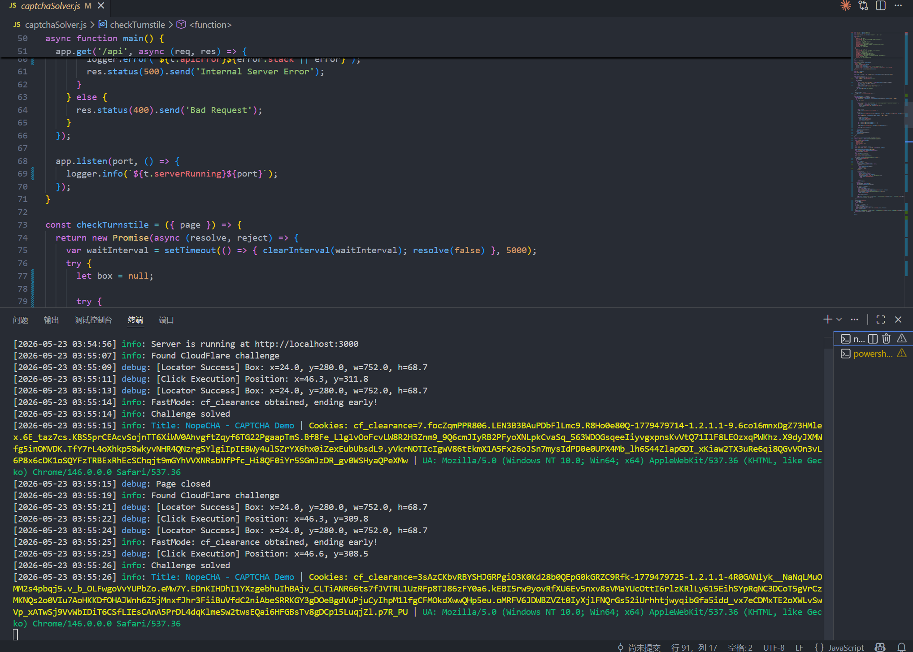
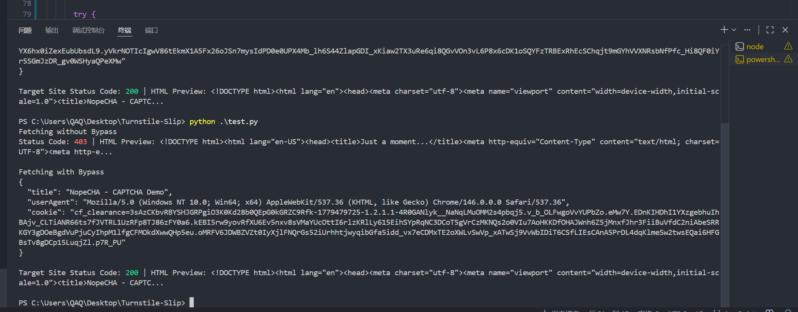

# Turnstile-Slip

该项目旨在实现自动化通过 Cloudflare Turnstile 质询，无需人工干预即可完成验证并获取 `cf_clearance`

## 展示

<video src="./assets/showcase.mp4" controls="controls" width="100%">您的浏览器不支持播放该视频</video>




## 启动

首次使用前，需要先安装所有相关依赖：

```bash
npm i
```

安装完成后，直接启动 Node.js 服务：

```bash
node captchaSolver.js
```
> 默认情况下，控制台日志会以 **中文** 输出。如果需要将日志输出切换为 **英文**，请在启动时附加 `--lang=en` 参数：

```bash
node captchaSolver.js --lang=en
```

## API 使用说明

### 请求示例

**普通模式**

```http
GET http://127.0.0.1:3000/api?target=https://nopecha.com/demo/cloudflare
```

**极速模式 (推荐)**

在 URL 末尾附加 `&fast=true` 参数

开启后，程序会高频轮询 Cookie，一旦捕捉到 Cloudflare 下发的`cf_clearance`，立刻关闭浏览器并返回数据，节约时间
```http
GET http://127.0.0.1:3000/api?target=https://nopecha.com/demo/cloudflare&fast=true
```

### 返回示例

```json
{
    "title": "NopeCHA - CAPTCHA Demo",
    "userAgent": "Mozilla/5.0 (Windows NT 10.0; Win64; x64) AppleWebKit/537.36 (KHTML, like Gecko) Chrome/146.0.0.0 Safari/537.36",
    "cookie": "cf_clearance=MHcI0vjPgnMzNpoGzOCFZ1AMCe322N2_EgTmddtgVyw-1715253876-1.0.1.1-w6HYChkfY9uJgY0G6nymjUMJhTb8IFJCD2wu1JC8_GfDWO_kXd0pP_fcKStObsKxWIlB6hede72pc1EIPV9J6g"
}
```
